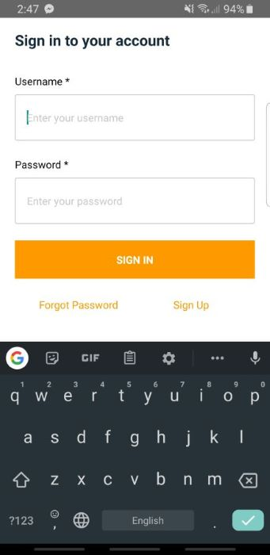
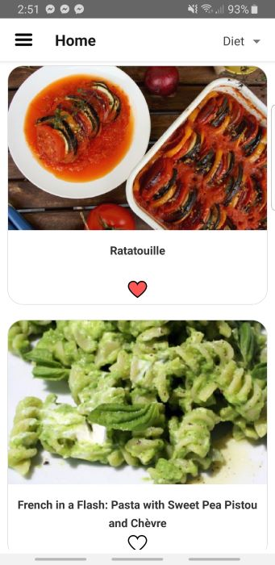
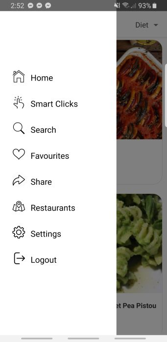
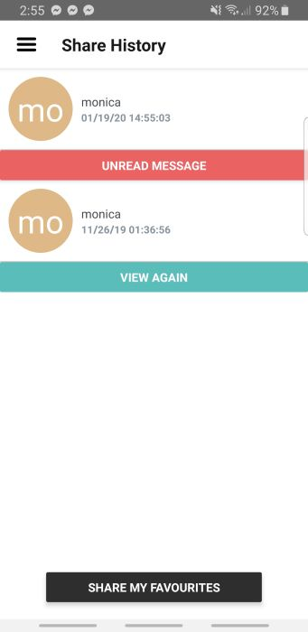
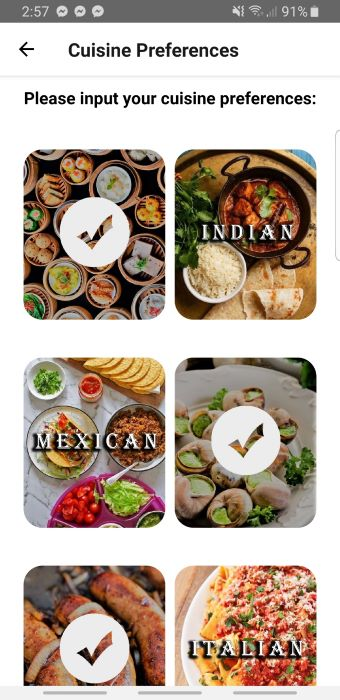

# FooD

Figma link (wireframe):
https://www.figma.com/file/w5KqwkUh6mEzhSa5mvX5SA/Foo-D
Spoonacular API keys:
e9d38bca69a446e295911c9453b8d9d8 (1st acct) this account will be paid
41bb3ae188994435afba430de732b502 (2nd acct)
2563ab89dda34b1389b8dcb12f725899 (3rd acct)
272ab141254d423892ae4bed14140ed2 (4th acct)
0dec2ec8d6a4404ea46e5cd804381812 (5th acct)
aa50e5ac8ae543d09badd04ed4ebaf9d (6th acct)
a4984101b27a4e2ab2c321a89bc1202d (7th acct)
a519625ee78e4bffa85a23b26650447b
5d07d03e9a8045a9b9fe28b2f2bd6294

#### Task to be done

1. Monica add the catch to ur run out of point of api
2. Add catch to API when run out of point 
   1. The user profile page Carter - need to expand?
   1. Like heart Monica - Done. TODO: extend to share page.
   
&nbsp;  
### Login and Home page
&nbsp;
 
&nbsp;&nbsp;&nbsp;&nbsp;&nbsp;&nbsp;&nbsp;&nbsp;&nbsp;&nbsp;&nbsp;&nbsp;&nbsp;&nbsp;&nbsp;&nbsp;&nbsp;&nbsp;&nbsp;&nbsp;&nbsp;&nbsp;

&nbsp;  
### Recipe and Ingredients page
&nbsp;
 
&nbsp;&nbsp;&nbsp;&nbsp;&nbsp;&nbsp;&nbsp;&nbsp;&nbsp;&nbsp;&nbsp;&nbsp;&nbsp;&nbsp;&nbsp;&nbsp;&nbsp;&nbsp;&nbsp;&nbsp;&nbsp;&nbsp;

&nbsp;  
### Menu Bar and Search page
&nbsp;

&nbsp;&nbsp;&nbsp;&nbsp;&nbsp;&nbsp;&nbsp;&nbsp;&nbsp;&nbsp;&nbsp;&nbsp;&nbsp;&nbsp;&nbsp;&nbsp;&nbsp;&nbsp;&nbsp;&nbsp;&nbsp;&nbsp;

&nbsp; 
### Favourites and Share page
&nbsp;

&nbsp;&nbsp;&nbsp;&nbsp;&nbsp;&nbsp;&nbsp;&nbsp;&nbsp;&nbsp;&nbsp;&nbsp;&nbsp;&nbsp;&nbsp;&nbsp;&nbsp;&nbsp;&nbsp;&nbsp;&nbsp;&nbsp;

&nbsp;  
### Restaurant and Settings -> Change Preferences page
&nbsp;

&nbsp;&nbsp;&nbsp;&nbsp;&nbsp;&nbsp;&nbsp;&nbsp;&nbsp;&nbsp;&nbsp;&nbsp;&nbsp;&nbsp;&nbsp;&nbsp;&nbsp;&nbsp;&nbsp;&nbsp;&nbsp;&nbsp;
